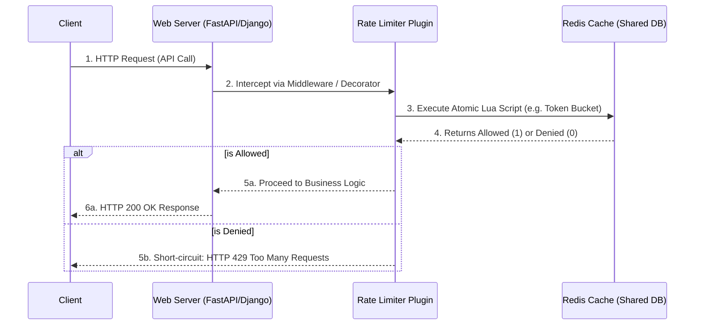

# Distributed Rate Limiter: Architecture & Interview Guide

This document contains everything you need to thoroughly explain this project in a system design interview, along with high-impact bullets for your resume.

---

## 1. High-Level Design (HLD)

The system is designed as a distributed, horizontally scalable middleware layer. 

### Architecture Flow

### Key HLD Decisions:
- **Why Redis?** In a distributed system (e.g., you have 5 backend instances behind a load balancer), keeping the rate limit state in local memory won't work. Instance A doesn't know how many requests Instance B processed. Redis acts as a fast, centralized, in-memory datastore so all instances share the exact same state.
- **Why a Plugin Architecture?** Instead of tightly coupling rate-limiting to the business logic, extracting it via Python Decorators (Django) or Dependencies (FastAPI) ensures the code conforms to the **Single Responsibility Principle**.

---

## 2. Low-Level Design (LLD)

### Algorithm Choice Extensibility (Strategy Pattern)
Different endpoints have different traffic patterns:
- **Sliding Window Log:** Mathematically the most accurate mechanism to prevent "boundary spikes". Smoothly tracks exact request timestamps.
- **Token Bucket:** The industry standard for handling bursty traffic (allows sudden spikes up to the bucket capacity while refilling at a steady rate).
- **Fixed Window:** Extremely memory efficient and fast, utilized when boundary spikes are an acceptable trade-off.

We implemented the **Strategy Design Pattern** by exposing an `Algorithm` Enum. The core engine dynamically evaluates the user's Enum choice and routes the parameters directly to the specific, pre-loaded Redis Lua script. 

### Addressing Concurrency & Race Conditions (The "Gotchas")
1. **The Race Condition:** If two servers check Redis at the exact same millisecond, they might both read that there is space left, and both allow the request, exceeding the limit.
   - **Solution:** We wrapped the entire read-and-write logic inside **Redis Lua Scripts**. Redis is single-threaded, meaning Lua scripts execute exactly instruction-by-instruction. It guarantees atomic operations mapping multiple commands (`ZREM`, `ZCARD`, `ZADD`) as a single, uninterrupted transaction.
2. **The Millisecond Overwrite Bug (Sliding Window Edge Case):** The Redis `ZADD` function operates on unique members. If two requests hit in the exact same millisecond, they have the exact same timestamp. Redis would treat the second request as a duplicate and just overwrite the old one, failing to count the second request!
   - **Solution:** We generated a unique **UUID on the Python layer** and appended it to the timestamp `"{timestamp}-{uuid}"` when inserting the Member into Redis. This ensures high-concurrent requests on the same millisecond remain distinct.

---

## 3. Resume Bullet Points

Pick the 1 or 2 bullets that best fit the "projects" or "experience" section of your resume:

*   **Architectured and implemented a framework-agnostic distributed rate limiter** in Python using Redis, successfully supporting both asynchronous (FastAPI) and synchronous (Django) architectures.
*   **Engineered a multi-algorithmic rate-limiting engine** (Sliding Window Log, Token Bucket, Fixed Window) using the Strategy Pattern to dynamically map to distinct Redis Lua Scripts inside Python Enums.
*   **Resolved distributed race conditions under highly concurrent loads** by wrapping multi-step Redis validations into atomic Lua scripts and orchestrating unique ID (UUID) injection to prevent subset collision.
*   **Packaged and open-sourced the rate-limiting logic** into a universal, installable Python module, allowing engineers to effortlessly integrate the system via FastAPI Dependencies or Django Middleware decorators.

---

## 4. How to Explain in an Interview (STAR Method)

**Situation:** "We needed a robust way to prevent API abuse and handle rate-limiting. A simple in-memory approach wouldn't work because our microservices scale horizontally behind a load balancer, meaning state has to be shared."

**Task:** "I was tasked with building a distributed rate limiter that was highly customizable (supporting multiple algorithms for different endpoints), resistant to concurrent race conditions, and could be utilized seamlessly across both our Django applications and modern FastAPI microservices."

**Action:** 
"I chose Redis as the centralized state store and embedded the entire logic into **Redis Lua Scripts**. This allowed me to treat the evaluation process (like Token Bucket capacity checks or Sliding Window log counts) as a single, atomic transaction, mathematically preventing race conditions where concurrent requests could bypass the limit.

I implemented multiple algorithms (Token Bucket, Fixed Window, Sliding Window) and utilized the Strategy Design Pattern so developers could pick their algorithm via a simple Python Enum. 

To overcome specific Redis edge cases—like identical timestamp collisions in Sliding Window ZSETs—I injected UUIDs at the application layer to enforce uniqueness. Finally, I abstracted everything into a universal Python package."

**Result:** "The result was a highly scalable, multi-algorithmic rate-limiter that acts as a plug-and-play middleware. We simulated load testing with concurrent async scripts across scaled containers, and the engine successfully handled the concurrency with zero limit breaches."
